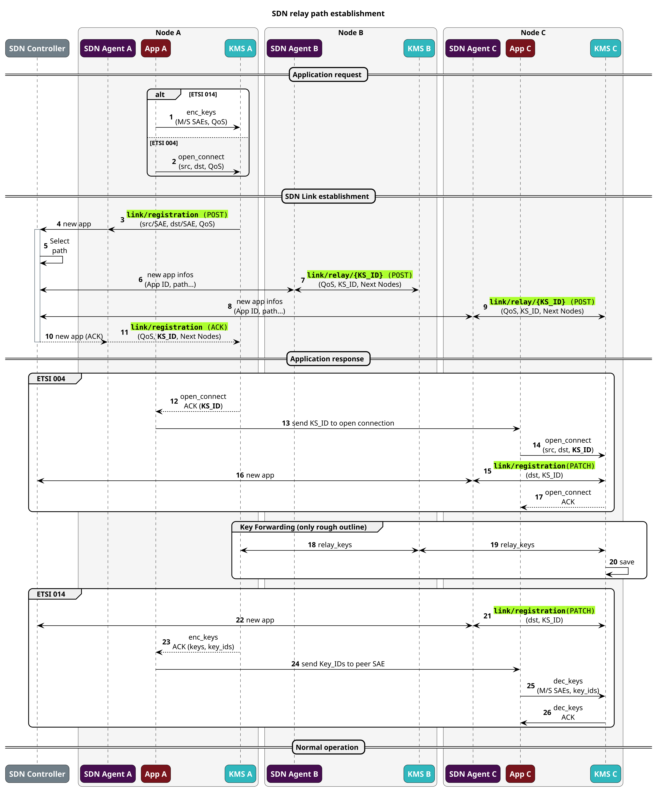
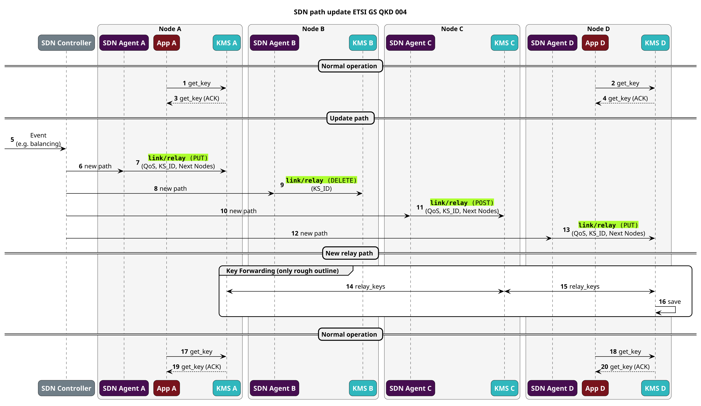
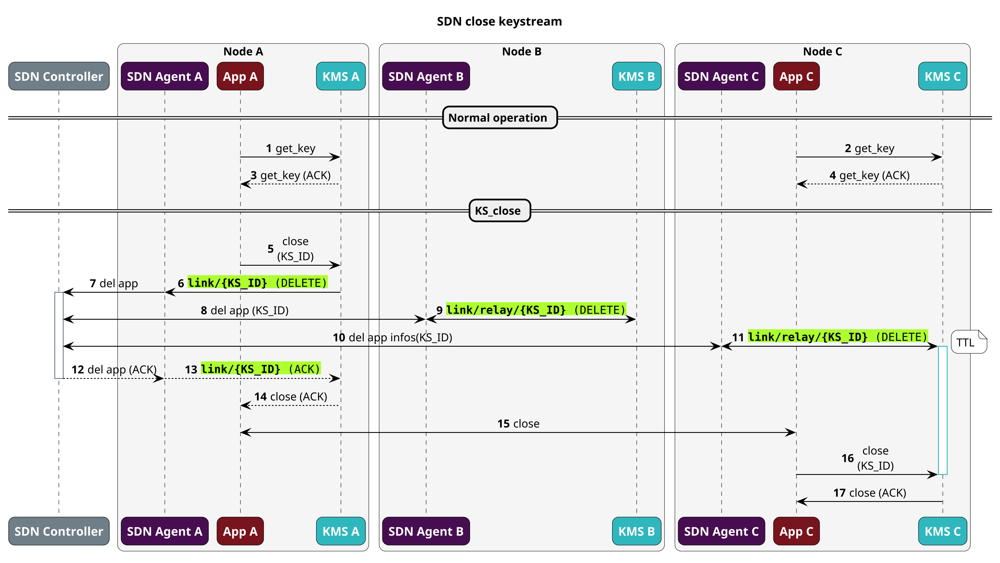
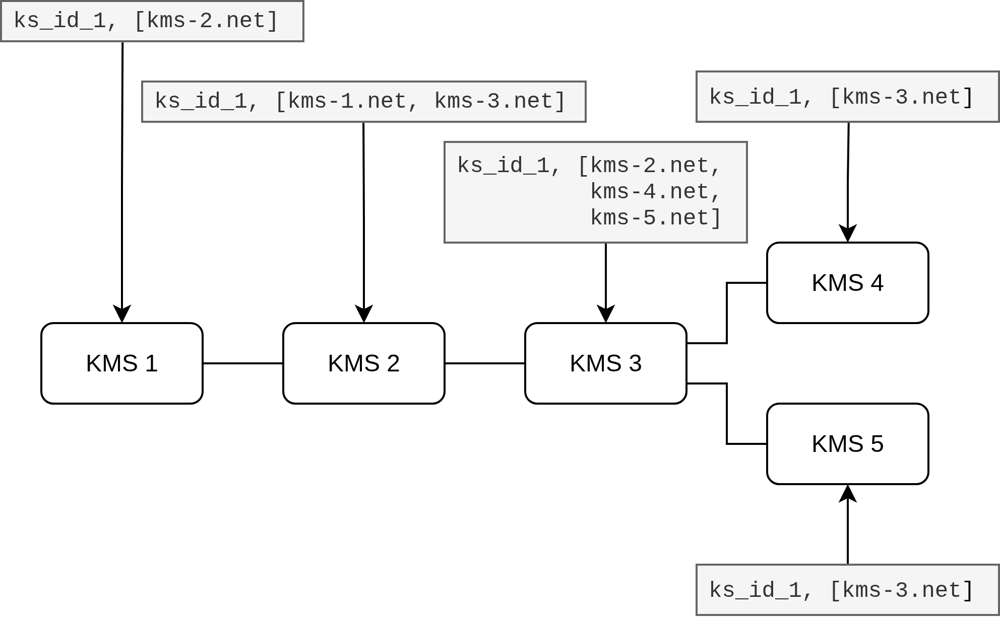
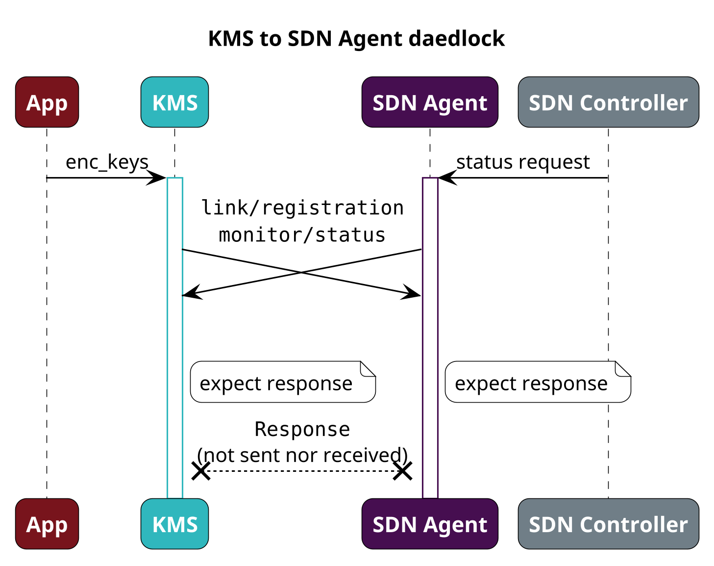
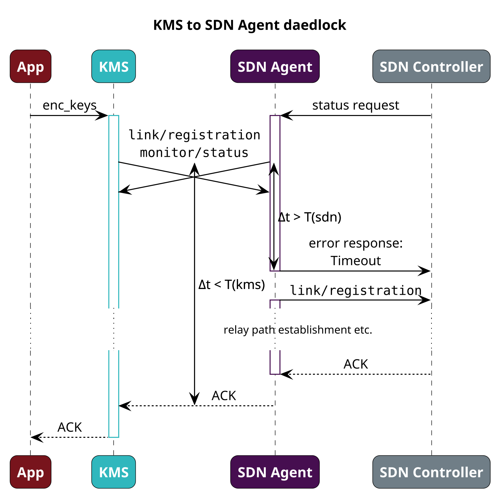
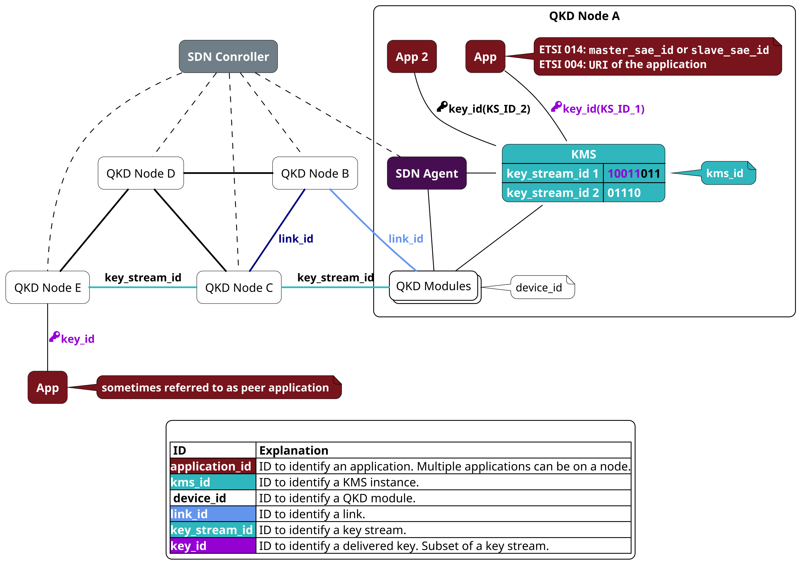

QUICKS Specification details<!-- omit in toc -->
==

- [1. Introduction](#1-introduction)
- [2. Sequences](#2-sequences)
  - [2.1. Link establishment](#21-link-establishment)
  - [2.2. Link update (ETSI 004 use-case)](#22-link-update-etsi-004-use-case)
  - [2.3. Key stream close (ETSI 004 use-case)](#23-key-stream-close-etsi-004-use-case)
- [3. Notes](#3-notes)
  - [3.1. next\_node\_info](#31-next_node_info)
    - [3.1.1. Note 1, URI authority type](#311-note-1-uri-authority-type)
    - [3.1.2. Note 2, list type](#312-note-2-list-type)
    - [3.1.3. Note 3: Entry order](#313-note-3-entry-order)
  - [3.2. peer\_application\_info](#32-peer_application_info)
  - [3.3. Deadlock-aware implementation](#33-deadlock-aware-implementation)
    - [3.3.1. Multithread / async patterns](#331-multithread--async-patterns)
    - [3.3.2. Timeout](#332-timeout)
  - [3.4. Explanation of IDs](#34-explanation-of-ids)
    - [3.4.1. application\_id](#341-application_id)
    - [3.4.2. kms\_id](#342-kms_id)
    - [3.4.3. device\_id](#343-device_id)
    - [3.4.4. link\_id](#344-link_id)
    - [3.4.5. key\_stream\_id](#345-key_stream_id)
    - [3.4.6. key\_id](#346-key_id)

# 1. Introduction

This document gives some additional details beyond the high level picture outlined in the top level [`readme.md`](../readme.md). It further expands on nuances too verbose to fit the OpenAPI description text.

# 2. Sequences

The following section states some common sequences for different use-cases and how this API is supposed to support the process. Some aspects, which are beyond this scope, are shortened.

In the sequences, the bold and green highlighted messages are within the scope of this API specification, all others are beyond the scope and only given for context. The data transmitted is also only a hint and does not display all data of that message.

## 2.1. Link establishment

As an application either opens a key stream via the ETSI GS QKD 004 `open_connect` or requests keys via ETSI GS QKD 014 `enc_keys`, the KMS first has to know via which path through the network the key(s) should be established. The error-free process works as follows and is displayed in a sequence diagram thereafter (error handling not described here):

- The application starts the request at the source KMS (msg 1, 2)
- The source KMS notifies its SDN Agent of the request (msg 3)
- The SDN Agent in turn notifies the SDN Controller (msg 4), which computes the path (msg 5) and notifies all SDN Agents in the relay path (msg 6, 8).
- The SDN Agents on the relay path configure the path with the next node infos to their corresponding KMS instances (msg 7, 9)
- The original source KMS message, after successful establishment of the relay path, is answered by the SDN Controller to the SDN Agent (msg 10) and in turn to the source KMS (msg 11)
- If the request was an `open_connect` via the ETSI GS QKD 004 interface, it is answered (msg 12) and as soon as the destination application requests the same key stream to be opened (msg 13, 14) the KMS notifies the SDN Agent of this link update (msg 15).
- If the request was an `enc_keys` via the ETSI GS QKD 014 interface, first the keys have to be established using the link (msg 18, 19, 20) and upon success the relay path is considered successfully closed, which is reported to the SDN Agent and in turn the SDN Controller (msg 21, 22). The `enc_keys` can now be safely answered (msg 23). The destination application can then obtain the same keys via `dec_keys` (msg 25, 26).



**Note 1:**
In case of the ETSI GS QKD 004, the established relay path can be used for all subsequent key requests (stateful).

**Note 2:**
In case of the ETSI GS QKD 014, each request by the application results in a new SDN request (stateless).

**Note 3:**
The KMS should request from the SDN paths which can also support any internal key consumption.

**Note 4:**
All communication beyond scope is only exemplary, specifically the communication between the SDN Controller and SDN Agent (messages 4, 6, 8, 10, 16, 22) is out of scope.

## 2.2. Link update (ETSI 004 use-case)

Since the ETSI GS QKD 004 is stateful, it can maintain its path. But high key consumption on a link or an unexpected event (e.g. QKD node unreachable) requires an update of the established path. The error-free process works as follows and is displayed in a sequence diagram thereafter (error handling not described here):

- The SDN Controller for some reason (e.g., load balancing event) recalculates the relay path (msg 5) and informs all SDN Agents of the current path (msg 6, 8, 12) and the new node SDN Agent (msg 10) of the change.
- The SDN Agents update (msg 7, 13), newly install (msg 11) or delete (msg 9) the KMS relay configuration, correspondingly if parts of the data are updated, completely new or to be removed.

This update works seamlessly without the application layer noticing, since normal operation (msg 1-4) continues after the newly established relay path (msg 17-20).



**Note 1:**

This message can also be used to tear down a link entirely by sending a `DELETE` to `/link/relay/{key_stream_id}` to every node, for example in case of a key stream close initiated by the SDN Controller.

**Note 2:**
All communication beyond scope is only exemplary, specifically the communication between the SDN Controller and SDN Agent (messages 6, 8, 10, 12) is out of scope.

## 2.3. Key stream close (ETSI 004 use-case)

The key stream of the ETSI GS QKD 004 can be closed by applications. The error-free process works as follows and is displayed in a sequence diagram thereafter (error handling not described here):

- After normal operation (msg 1-4), the application can close a session with the `close` message (msg 5).
- In this case the KMS notifies the SDN Agent (msg 6) of this event.
- In turn the Controller notifies all other SDN Agents (msg 8, 10)
- The SDN Agents notify the KMS (msg 9, 11), which delete their relay info and other relevant data associated with the key stream. The destination KMS must keep any keys for the negotiated TTL, for which this is the starting time (or until a close is issued (msg 16)).
- The response to the original SDN notification is issued (msg 13) and the application is informed of the successful closing of the key stream. The application then can inform its peer app (msg 15), so it can also close the key stream (msg 16, 17)



# 3. Notes

The following section contains some clarifications and additional visualizations for specific messages.

## 3.1. next_node_info

`POST` and `PUT` of SDN to KMS API `/link/relay/{key_stream_id}`, as well as the response of the KMS to SDN API `POST` `/link/registration`, contain the data field `next_node_info` for which some notes are given here:

### 3.1.1. Note 1, URI authority type

The KMS should be able to use the [URI authority](https://datatracker.ietf.org/doc/html/rfc3986#section-3.2) (as per RFC 3986) to reach the endpoint of the peer KMS, but only the authority is given, the path, scheme and other components should be known to each KMS implementation.
The following is from [`RFC3986`](https://datatracker.ietf.org/doc/html/rfc3986), only slightly reformatted (authority highlighted with `**`):

```text
  foo://example.com:8042/over/there?name=ferret#nose
  └┬┘   ┗━━━━━━┳━━━━━━━┛└───┬─────┘ └────┬────┘ └─┬┘
scheme   **authority**     path        query   fragment
```

This can be a plain IP address (v4/v6 or others) with a port or a domain name, for which a Domain Name System (DNS) ([`RFC 1035`](https://datatracker.ietf.org/doc/html/rfc1035)) is set up, either via a DNS Server or locally resolved names. With a DNS layer the IP layout is conveniently obfuscated, also allowing the IPs to change without the need to change the associated URIs. On the other hand, a DNS layer requires additional configuration effort.

### 3.1.2. Note 2, list type

The node entries are a list type, because bidirectional and multi-path forwarding should be supported. Each KMS instance receives all the neighboring relaying nodes' URIs, as shown in the following figure:



The following explanation assumes **hop-by-hop relay** (figure 5 and 6 of [Rec. ITU-T Y.3803](https://www.itu.int/rec/T-REC-Y.3803/_page.print)), but the other schemes work as well as outlined later:

- **For KMS 1:** it knows it's the source (as it is the source of the App query), so it generates the combination of RNG key with specified KMS 2 (may be skipped if final key is not random sourced).
- **For KMS 2:** if a relay request was sent from KMS 1, it has to forward the request to all peers in the list that are not the sender of the request, so only to KMS 3. In case KMS 3 sent the request, the same logic applies: it is relayed to KMS 1.
- **For KMS 3:** if a relay request was sent from KMS 2, it has to forward the request to all peers in the list that are not the sender of the request, so to KMS 4 and 5. In case KMS 4 sent it, the same logic applies: it is relayed to KMS 2 and 5.

In case of the **centralized key relay** (figure 8 of [Rec. ITU-T Y.3803](https://www.itu.int/rec/T-REC-Y.3803/_page.print)):

- **For KMS 1:** it knows it's the source (as it is the source of the App query), so it generates the combination of RNG key with specified KMS 2 to the central KMS (may be skipped if final key is not random sourced).
- **For KMS 2:** it combines the specified kms keys associated with the peers in the list and sends them to the central KMS
- **For KMS 3:** it combines each entry in the list with the first entry and sends them to the central KMS.
- **For KMS 4 and 5:** as they are not the source of this request, they know to expect the message from the centralized KMS (beyond scope of this specification) and use keys with the previous to decrypt.

In the case of the **destination relay** (figure 7 of [Rec. ITU-T Y.3803](https://www.itu.int/rec/T-REC-Y.3803/_page.print)), [which also works using RNG at Node A]:

- **For KMS 1:** it knows it's the source (as it is the source of the App query), so it generates the combination of RNG key with specified KMS 2 to the central KMS (may be skipped if final key is not random sourced).
- **For KMS 2:** it combines the specified kms keys associated with the peers in the list and sends them to the destination (destination is a field in the `/link/relay` data).
- **For KMS 3:** it combines the first and second key and sends it to the first destination and the first and third key and sends it to the second destination.
- **For KMS 4 and 5:** as they are not the source of this request, they know to expect the message from the previous KMS.

### 3.1.3. Note 3: Entry order

For the "hop-by-hop" relay, the order of the specified URIs does not matter. For other schemes outlined in [Rec. ITU-T Y.3803](https://www.itu.int/rec/T-REC-Y.3803/_page.print) it matters for the group key and multi path use-case.
For example in the setup depicted above, if the "destination relay" method is used, KMS 3 must combine keys shared with KMS 2 (referenced by `kms-2.net`) with keys for KMS 4 and send the product to 4, correspondingly KMS 2 keys with KMS 5 keys to send to KMS 5. It is not useful to combine KMS 4 keys with KMS 5 keys and send them to KMS 2.
Therefore, in case of more than two elements, the first entry is designated as the primary one, with whom the others are to be combined.

The destination array for multi path must correspond accordingly for the "destination relay" method.

## 3.2. peer_application_info

Some messages have the additional field `peer_application_info` this is required for group key applications supported by ETSI GS QKD 014. Specifically for the case where the peer applications are spread across multiple nodes. See also [Issue description](https://github.com/ait-crypto/kms-sdn-agent-interface-specification/issues/57).

## 3.3. Deadlock-aware implementation

As both communication partners, the KMS and SDN Agent, are a server and a client, it is important to implement those in a way to avoid deadlocks. The following figure outlines a deadlock situation, where at the same time the KMS is a client to the SDN Agent and vice versa.



This is an issue which can usually be solved with different implementation techniques, some of which are outlined here. But to emphasize, this is beyond the API specification, but on the implementation of the KMS or SDN Agent. The following notes are meant as high-level suggestions.

### 3.3.1. Multithread / async patterns

Implement the server and client in different threads This way the client can wait in its thread for the response, while the request at its server can be handled separately.

### 3.3.2. Timeout

Using different timeout behavior is a simple solution. Non-essential messages for which error handling can be easily implemented should have a lower timeout, so for example:



## 3.4. Explanation of IDs

Several different IDs are used to identify either components, data or data structures. They are briefly defined and explained in this section.



### 3.4.1. application_id

The `application_id`, also referred to as `app_id`, `master_sae_id` or `slave_sae_id`, identifies the entity which uses the key provided by the QKD Network. As the primary use-case is symmetric cryptography, the applications usually act in pairs, where the other side of the pair is referred to as "peer application".

### 3.4.2. kms_id

The `kms_id`, also referred to as `kme_id` in ETSI 014, identifies one instance of the key management layer on a QKD node. This instance implements the key management and key distribution functionality.

### 3.4.3. device_id

The `device_id` identifies one instance of the QKD layer, which is involved in a QKD protocol.

### 3.4.4. link_id

The `link_id` identifies an edge in the QKD network graph, where at the vertices a key pair is generated using a QKD protocol.

Oftentimes the `link_id` correlates with the quantum channel or QKD device deployment, but that is explicitly not the definition. The `link_id` is independent of device specifics or the physical layer, as the following examples show:

- For QKD devices or protocols, which have non-key producing components (e.g. in entanglement based QKD, with a middle device) the `link_id` only refers to the endpoints, which produce keying material. As a result in this example, devices involved in a QKD protocol can have no associated `link_id`.
- For QKD network configurations where devices can establish multiple connections, e.g. in a switched network or multiple endpoints in entanglement QKD, each connection gets its own `link_id` as long as they can generate key pairs. As a result in this example, a device can be part of multiple different `link_id`s.
- For deployments, where multiple different devices can generate key pairs at the same two nodes, only one `link_id` is given, for example in redundant parallel deployments. As a result in this example, a `link_id` can be associated with multiple QKD devices.

### 3.4.5. key_stream_id

The `key_stream_id`, also referred to as `ks_id` references the relay path used to establish end-to-end keys in the KMS. It also refers to a group of individual keys (which are referenced by the `key_id`) in the KMS storage. This can be a data stream or several segregated database entries, which all were established via the same set of links in a key relay process.

### 3.4.6. key_id

The `key_id` is not used in this specification, but refers to a single key value.
