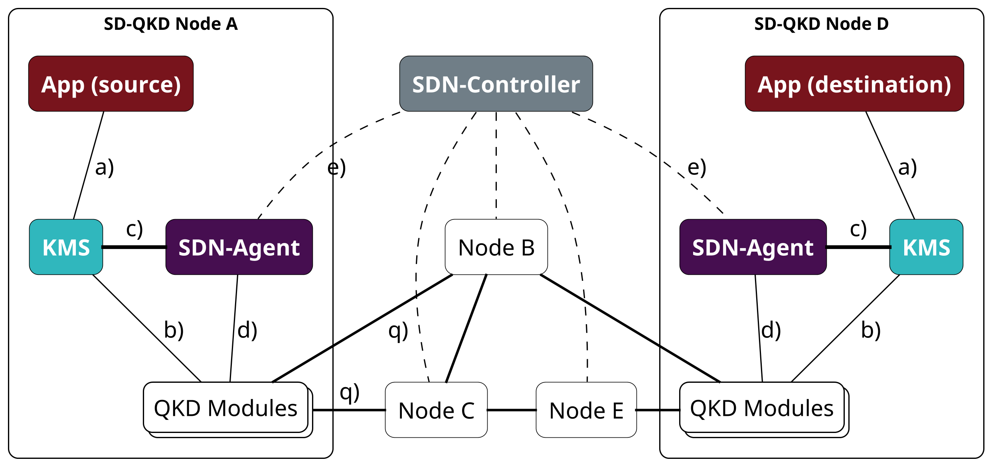
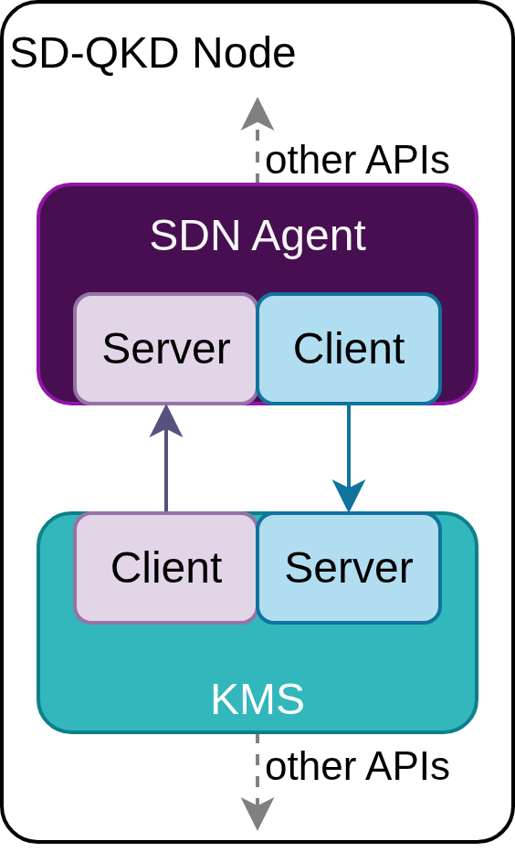
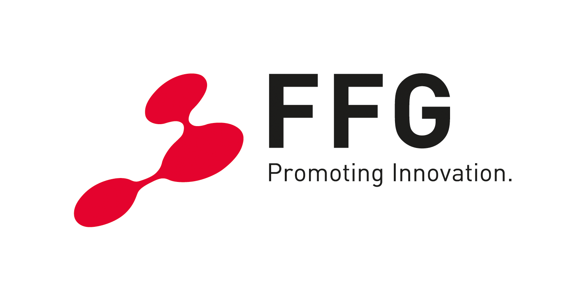

QUICKS: QKDN Universal Interface for Communication between KMS and SDN<!-- omit in toc -->
==

- [1. Overview](#1-overview)
- [2. API outline](#2-api-outline)
- [3. Notes](#3-notes)
  - [3.1. Scope](#31-scope)
  - [3.2. How to use OpenAPI specification format](#32-how-to-use-openapi-specification-format)
  - [3.3. Security](#33-security)
  - [3.4. ETSI GS QKD 015 compatibility](#34-etsi-gs-qkd-015-compatibility)
  - [3.5. Vendor specifics support](#35-vendor-specifics-support)
  - [3.6. Error codes](#36-error-codes)
  - [3.7. Related publications](#37-related-publications)
- [4. Acknowledgements](#4-acknowledgements)

This repository hosts and maintains the API description developed by AIT for an interface between a Key Management System (KMS) and a Software Defined Network (SDN) Agent for Quantum Key Distribution Networks (QKDN).

This table gives quick links to the API descriptions:

|API | OpenAPI file |PDF view | Web view |
|----|--------------|---------|----------|
| KMS Server API |[`sdn_to_kms_api.yaml`](openapi/sdn_to_kms_api.yaml)|  | |
| SDN Server API | [`kms_to_sdn_api.yaml`](openapi/kms_to_sdn_api.yaml) | |  |

# 1. Overview

The figure above depicts a common way of deploying an SDN-managed QKD Network according to ETSI GS QKD 015. The interfaces of such a network are marked as follows:

a) KMS to Application Interface, typically ETSI GS QKD [014](https://www.etsi.org/deliver/etsi_gs/QKD/001_099/014/01.01.01_60/gs_qkd014v010101p.pdf) or [004](https://www.etsi.org/deliver/etsi_gs/QKD/001_099/004/02.01.01_60/gs_qkd004v020101p.pdf).

b) KMS to QKD interface, typically ETSI GS QKD [014](https://www.etsi.org/deliver/etsi_gs/QKD/001_099/014/01.01.01_60/gs_qkd014v010101p.pdf) or [004](https://www.etsi.org/deliver/etsi_gs/QKD/001_099/004/02.01.01_60/gs_qkd004v020101p.pdf).

c) **KMS to SDN Agent interface. → QUICKS**

d) SDN Agent to QKD interface, typically ETSI GS QKD [023 (draft)](https://portal.etsi.org/webapp/WorkProgram/Report_WorkItem.asp?WKI_ID=69537).

e) SDN Agent to SDN Controller Interface, typically ETSI GS QKD [015](https://www.etsi.org/deliver/etsi_gs/QKD/001_099/015/02.01.01_60/gs_QKD015v020101p.pdf).

q) Quantum channel, typically optical fiber.

As it becomes apparent from this list, the KMS to SDN-Agent interface lacks clear specification by ETSI GS QKD or any other organization. Therefore, AIT developed a simple API with a low barrier for adaption and a feature set which satisfies the requirements of an SDN-managed QKDN.

An earlier version of this API was developed together with Universidad Politécnica de Madrid (UPM), Nextworks and Telefonica within the scope of the [DISCRETION project](https://discretion-eu.com/).

# 2. API outline

The API is implemented as a https REST API in a bidirectional setup, where the KMS and SDN Agent host a server and can act as a client with the other peer. Therefore, two APIs are described. The API further considers both the ETSI 014 and ETSI 004 application interface setups.

You can find the openAPI descriptions at:

- [`openapi/kms_to_sdn_api.yaml`](openapi/kms_to_sdn_api.yaml) for the API, where the SDN Agent hosts the server and the KMS initiates client requests.
- [`openapi/sdn_to_kms_api.yaml`](openapi/sdn_to_kms_api.yaml) for the API, where the KMS hosts the server and the SDN Agent initiates client requests.

You can find static renders (html or pdf) of this API either in the table on top or see [3.2. How to use OpenAPI specification format](#32-how-to-use-openapi-specification-format).

> [!IMPORTANT]
> **Sequence diagrams and API details can be found in [`doc/readme.md`](doc/).**

# 3. Notes

Some notes are given in this section.

## 3.1. Scope

This API's scope is limited to the interaction between the KMS and SDN Agent in the context of QKD Networks. Explicitly beyond scope are any details on the SDN Controller, QKD Layer, key establishment in QKD Networks or cryptographic aspects.

## 3.2. How to use OpenAPI specification format

[The OpenAPI initiative](https://www.openapis.org/) is a [Linux foundation project](https://www.linuxfoundation.org/projects) and "provides a formal standard for describing HTTP APIs". They publish documents on [how to use them](https://learn.openapis.org/). The API is described in a formal text based language, usually written in a yaml format, but others are also supported.

There are different ways to visualize the yaml file in a user-friendly way, the authors of this repo have no affiliation with any of those services. As the original founders of the OpenAPI specification language, Swagger [provides a tool](https://swagger.io/tools/swagger-ui/) to visualize OpenAPI specifications. A popular way is to use a text editor and install an OpenAPI plugin, which can visualize the yaml in an interactive preview. This can be for example [VS Code](https://code.visualstudio.com/) as editor and [OpenAPI Preview](https://github.com/zoellner/openapi-preview), [OpenAPI (Swagger) Editor](https://marketplace.visualstudio.com/items?itemName=42Crunch.vscode-openapi) or [Redocly OpenAPI](https://github.com/Redocly/redocly-vs-code). Another option is importing the files to [postman](https://www.postman.com/).

For convenience static views are automatically generated by the [GitHub Action](https://github.com/ait-crypto/kms-sdn-agent-interface-specification/actions/workflows/openapi-docs.yml).
As it is based on automated tooling, error free generation can not be guaranteed, if the static render in HTML or PDF diverge from the OpenAPI specification in the .yaml format, the original OpenAPI specification shall prevail.

The tool [Redocly](https://redocly.com/docs/cli) generates the HTML, which is then hosted as a GitHub page for convenience:

- GitHub page of the [KMS API (main branch)](https://ait-crypto.github.io/kms-sdn-agent-interface-specification/main/html/sdn-to-kms-api.html)
- GitHub page of the [SDN API (main branch)](https://ait-crypto.github.io/kms-sdn-agent-interface-specification/main/html/kms-to-sdn-api.html)
- GitHub page of the [KMS API (development branch)](https://ait-crypto.github.io/kms-sdn-agent-interface-specification/development/html/sdn-to-kms-api.html)
- GitHub page of the [SDN API (development branch)](https://ait-crypto.github.io/kms-sdn-agent-interface-specification/development/html/kms-to-sdn-api.html)

Any other branch can be viewed by adapting the URL, provided it triggered the corresponding GitHub action: `https://ait-crypto.github.io/kms-sdn-agent-interface-specification/<branch-name>/html/sdn-to-kms-api.html` and `https://ait-crypto.github.io/kms-sdn-agent-interface-specification/<branch-name>/html/kms-to-sdn-api.html`. If the `<branch_name>` contains the `/` character, it has to be replaced by a `-` character.

The PDF is generated with [rapipdf-cli by kingjan1999](https://github.com/kingjan1999/rapipdf-cli/tree/master), a cli wrapper for the [RapiPDF](https://github.com/mrin9/RapiPdf) tool. The PDFs are also deployed at the corresponding GitHub page:

- PDF of the [KMS API (main)](https://ait-crypto.github.io/kms-sdn-agent-interface-specification/main/pdf/sdn_to_kms_api.pdf)
- PDF of the [SDN API (main)](https://ait-crypto.github.io/kms-sdn-agent-interface-specification/main/pdf/kms_to_sdn_api.pdf)
- PDF of the [KMS API (development)](https://ait-crypto.github.io/kms-sdn-agent-interface-specification/development/pdf/sdn_to_kms_api.pdf)
- PDF of the [SDN API (development)](https://ait-crypto.github.io/kms-sdn-agent-interface-specification/development/kms_to_sdn_api.pdf)

Any other branch can be viewed by adapting the URL, provided it triggered the corresponding GitHub action: `https://ait-crypto.github.io/kms-sdn-agent-interface-specification/<branch-name>/pdf/sdn_to_kms_api.pdf` and `https://ait-crypto.github.io/kms-sdn-agent-interface-specification/<branch-name>/pdf/kms_to_sdn_api.pdf`. If the `<branch_name>` contains the `/` character, it has to be replaced by a `-` character.

## 3.3. Security

The SDN Agent and KMS are supposed to be deployed in the same security perimeter, also referred to as trusted node. Attacks on the API should therefore be prevented by the perimeter security mechanisms. However, as the technical implementation hurdles are very low, TLS 1.3 is required for this interface.

## 3.4. ETSI GS QKD 015 compatibility

Unfortunately some bugs in the ETSI GS QKD 015 v2.1.1. specification are not resolved yet. If strictly following ETSI GS QDK 015 some issues will arise:

- ETSI GS QKD 015 v2.1.1. specifies that the SDN Controller first must be notified from both endpoints before a relay path is established. This may be possible with ETSI GS QKD 004, but is incompatible with ETSI GS QKD 014 (the more adopted specification). ETSI GS QKD 014 clearly already needs the final keys at `enc_keys` before the second node even knows of the `dec_keys` request. Therefore, the path must be established at the first request at the source.
- ETSI GS QKD 015 v2.1.1. does not publish the most important metric, which is the key availability (KAV) at the KMS layer. This API publishes it as `KAV` via the `link/performance/{link_id}` endpoint, but if required the SDN Controller can derive the ESKR: $ESKR = \dfrac{\Delta KAV}{\Delta t}$.

## 3.5. Vendor specifics support

Some select data fields are supposed to be vendor specific. This is done deliberately to give KMS Vendors more freedom to innovate. It is expected that an SDN Controller can have vendor specific plugins which handle those vendor specifics.
Such examples are:

- Reported error codes and messages: it is not feasible for a specification to note all internal errors a KMS implementation can or wants to publish.
- Zero-touch provisioning config: since each KMS has a unique feature set and may also not support remote configuration, the config file (which can be given as a response to the KMS registration message) is not defined. As soon as a KMS registers to the SDN, a plugin in the Controller should generate the vendor-specific configuration.

## 3.6. Error codes

Some http error codes are defined in the OpenAPI description. However, all http error codes are acceptable as defined in [RFC 9110](https://datatracker.ietf.org/doc/html/rfc9110#name-status-codes). The content of the response it also outlined in some cases and follows [RFC 9457](https://www.rfc-editor.org/rfc/rfc9457.html), but mostly limits itself to the `type`, `title`, `status` and `detail` field. Any error codes should follow that pattern. Specifically any feature foreseen in this API but not supported by the KMS or SDN Agent implementation should use the 501 error code. `404 Not Found` responses typically do not require a response body. Such responses may be generated by the web server or HTTP framework when the requested resource or endpoint is not available, and may not support producing a structured error representation.

## 3.7. Related publications

This repository complements research presented in the following publications:

- S. Laschet, G. Lendvay, T. Lorünser, P. James, L. Torresetti and A. Colombo, "Software Defined Networks Key Relay for Large-Scale Quantum Key Distribution Networks," 2026 International Conference on Quantum Communications, Networking, and Computing (QCNC), Kobe, Japan, 2026, pp. 715-719, doi: [10.1109/QCNC69040.2026.00115](https://doi.org/10.1109/QCNC69040.2026.00115).
- James, P, Laschet, S, Ramacher, S & Torresetti, L 2023, Key Management Systems for Large-Scale Quantum Key Distribution Networks. in ARES '23: Proceedings of the 18th International Conference on Availability, Reliability and Security., 126, ACM International Conference Proceeding Series, S. 1-9, ARES 2023: The 18th International Conference on Availability, Reliability and Security, Benevento, Italy, 29/08/23. [https://doi.org/10.1145/3600160.3605050](https://doi.org/10.1145/3600160.3605050).
- Brito, JP, Ballesta, J, Brito-Mendez, R, Mengual, L, Ortíz, L, Martin, V, Cantó, R, Muñiz, A, Pastor, A, Lopez, D, Laschet, S, Ramacher, S, Piscione, P, Abdulwahed, AK, Giardina, P, Freitas, M, Calé, R, Maia, L, Magalhães, L, Anjos, G, Chaves, R, Afonso, J, Martins, P, Dias, T, Pinto, F, Vieira, M, Bacar, R & Bastos, C 2025, Secure Network Innovation in Defense: SDN and Quantum Cryptography with DISCRETION. in 2025 International Conference on Quantum Communications, Networking, and Computing (QCNC). S. 261 - 268, International Conference on Quantum Communications, Networking, and Computing (QCNC 2025), Nara, Japan, 31/03/25. [https://doi.org/10.1109/QCNC64685.2025.00049](https://doi.org/10.1109/QCNC64685.2025.00049).
- Valbusa, F, Lorünser, T, Spini, G & Laschet, S 2025, Relaxing the Single Point of Failure in Quantum Key Distribution Networks: An Overview of Multi-path Approaches. in F Skopik, V Naessens & B De Sutter (Hrsg.), Availability, Reliability and Security: ARES 2025 EU Projects Symposium Workshops, Ghent, Belgium, August 11–14, 2025, Proceedings, Part I. Bd. 15998, Lecture Notes in Computer Science, Bd. 15998, Springer, S. 183–200, ARES 2025 EU Projects Symposium Workshops, Ghent, Belgium, 11/08/25. [https://doi.org/10.1007/978-3-032-00642-4_11](https://doi.org/10.1007/978-3-032-00642-4_11).
- Bastos, C, Pinto, F, Bacar, R, Anjos, G, Almeida, M, Pinto, AN, Chaves, R, Dias, T, Afonso, J, Calé, R, Freitas, M, Maia, L, Magalhães, L, Muñiz, A, Cantó, R, Brito, JP, Ballesta, J, Méndez, RB, Laschet, S, Ramacher, S, James, P, Torresetti, L, Piscione, P, Abdulwahed, AK, Giardina, P, Martin, V, Ortiz, L, Pastor, A, Muga, N, Silva, N, López, D, Vieira, M, Escribano, C & Mengal, L 2025, DISCRETION: First Field Demonstration of a Quantum Enabled SDN in the Context of a Military Exercise. in 2025 International Conference on Military Communication and Information Systems (ICMCIS). S. 11-18, 2025 International Conference on Military Communication and Information Systems (ICMCIS), Oeiras, Portugal, 13/05/25. [https://doi.org/10.1109/icmcis64378.2025.11047713](https://doi.org/10.1109/icmcis64378.2025.11047713).

# 4. Acknowledgements

Different aspects of this work were enabled by Co-funding:

From Digital Europe Program under project numbers 101091642 ("QCI-CAT"), 101091588 ("QUARTER"), and 101091564 ("eCausis").
From European Union’s Horizon Europe research and innovation program under Grant Agreement No. 101114043 ("QSNP").
From the Österreichische Forschungsförderungsgesellschaft mbH (FFG) research program "Breitband Austria 2030: GigaApp 2. Ausschreibung" under Project Number: FO999917949 ("Q-Crit Austria").

 
